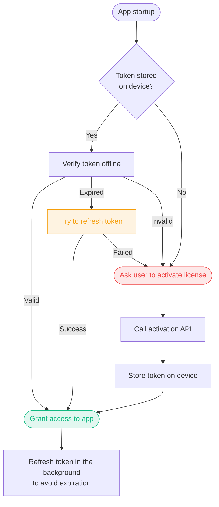

<include cwd>./components/mdx/license-token.mdx#page-header</include>

<Steps>
<Step>

### Configure license tokens for a product

Go to [license tokens](https://keyforge.dev/dashboard/addons/license-token) and add a new product. You can edit how much time a token will be valid for, and other options after creating the new configuration.

<Callout>
  For setups with more than one product, duplicate the signing key pair from
  another product inside the **edit** menu. You can also import an external key
  pair.
</Callout>

</Step>

<Step>

### Retrieve initial token

The simplest way to get and store the first license token on a device is after activating a license. You should use the [activate license](/api-reference/public/public-activate-license) API endpoint.

```bash
curl -X POST https://keyforge.dev/api/v1/public/licenses/activate \
  -H "Content-Type: application/json" \
  -d '{
    "licenseKey": "ABCDE-ABCDE-ABCDE-ABCDE-ABCDE",
    "deviceIdentifier": "some_device_id",
    "deviceName": "My device",
    "productId": "p_123456"
  }'
```

A `token` property will be returned in the response. Store this token in the device's storage.

<Accordions>
<Accordion title="Example response">

Example response from the API if the activation is successful.

```json
{
  "isValid": true,
  "status": "active",
  "token": "...", // The license token
  "device": {
    "identifier": "some_device_id",
    "name": "My device",
    "activationDate": "2023-05-19T18:39:33.000Z"
  },
  "license": {
    "key": "ABCDE-ABCDE-ABCDE-ABCDE-ABCDE",
    "productId": "p_123456",
    "type": "perpetual",
    "revoked": false,
    "maxDevices": 5,
    "expiresAt": null,
    "createdAt": "2023-05-19T18:39:33.000Z"
  }
}
```

</Accordion>
</Accordions>

</Step>

<Step>

### Verify the token

To verify the token, use any [JWT library](https://jwt.io/libraries) available in your programming language. Here are some tips you should follow:

- The token is signed using an **ES256** key pair. The public key is in the [dashboard](https://keyforge.dev/dashboard/addons/license-token).
- Check the `exp` claim to see if the token is still valid.
- Check `productId` and `deviceIdentifier` to make sure the token is valid for the current product and device.
- Do not ask the user to activate a license if the token is expired but was valid at some point. Try to refresh it first, and if it fails, then ask the user to activate a license.

<Callout>
  The token should be verified when the app starts, but it can also be verified
  periodically.
</Callout>

</Step>

<Step>

### Refresh the token

The token needs to be refreshed periodically to ensure it remains valid. Use the [license token](/api-reference/public/public-license-token) API endpoint.

<Callout>
  You should refresh the token some time before it expires, for example, 3 days
  before the expiration date.
</Callout>

```bash
curl -X POST https://keyforge.dev/api/v1/public/licenses/token \
  -H "Content-Type: application/json" \
  -d '{
    "licenseKey": "ABCDE-ABCDE-ABCDE-ABCDE-ABCDE",
    "deviceIdentifier": "some_device_id",
    "productId": "p_123456"
  }'
```

A `token` property will be returned in the response. Store this token in the device's storage.

<Accordions>
<Accordion title="Example response">

Example response from the API if the license is valid and the token was signed successfully.

```json
{
  "isValid": true,
  "status": "active",
  "token": "..." // The license token
}
```

</Accordion>
</Accordions>

</Step>

</Steps>

## Example workflow

Here is an example of how the license token verification workflow could look like in an application:



## Learn more

### Token payload

A signed license token contains the following data:

```json
{
  "status": "active",
  "license": {
    "key": "ABCDE-ABCDE-ABCDE-ABCDE-ABCDE",
    "productId": "p_123456",
    "type": "perpetual",
    "expiresAt": null,
    "createdAt": 1684521573, // Unix timestamp in seconds
    "maxDevices": 5,
    "email": null
  },
  "device": {
    "identifier": "some_device_id",
    "name": "My device",
    "activationDate": 1684521573 // Unix timestamp in seconds
  }
}
```

<Callout>
  There are also some additional claims in the token, such as `exp` (expiration
  time) and `iat` (issued at time). It is signed using the **ES256** algorithm.
</Callout>

### API Reference

<Cards>
  <Card
    title="Get license token"
    href="/api-reference/public/public-license-token"
    description="Fetch a new signed license token."
  />
  <Card
    title="Get license token public key"
    href="/api-reference/public/public-product-license-token-public-key"
    description="Get the public key used to verify license tokens for a product."
  />
</Cards>
